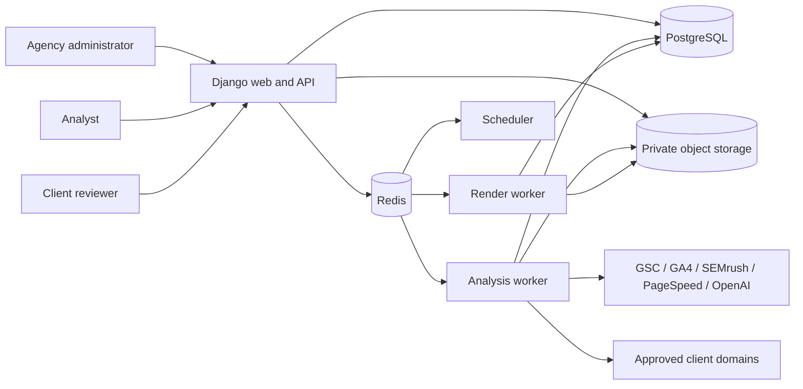
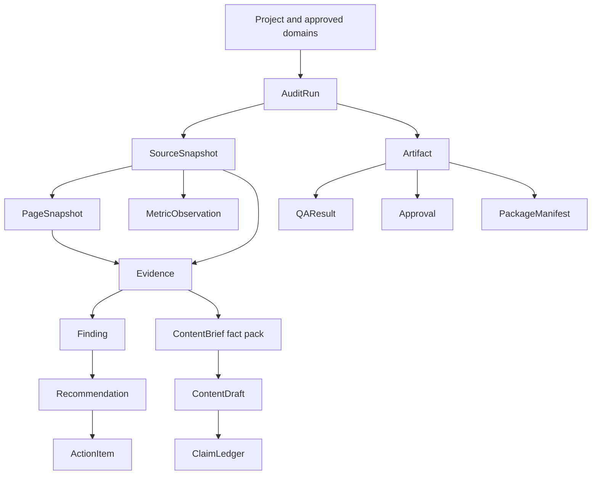

# Traffic Radius Enterprise SEO Studio architecture

Document owner: Traffic Radius engineering  
Review cadence: at every release and after any trust-boundary change  
System version described: `1.0.0`  
Last reviewed: 2026-07-15

## Purpose and architectural promises

Traffic Radius Enterprise SEO Studio is an evidence-led system for collecting SEO evidence, producing deterministic audit findings, coordinating human approvals, and rendering controlled client deliverables. It is intentionally not a CMS, publishing system, outreach platform, or automatic disavow submitter. Externally consequential files are proposals until the required people approve them.

The architecture is built around six promises:

1. A client reviewer can only see assigned projects and approved artifacts.
2. A measured or derived assertion remains traceable to a dated source snapshot or is marked unavailable.
3. Missing credentials reduce coverage; they never create substitute data.
4. A run advances through explicit, resumable states and cannot bypass review or QA gates.
5. Crawled and uploaded material is untrusted data, including when supplied to a language model.
6. An exported package is reproducible, checksummed, and reconciled to canonical records.

## Status language used in this document

This document distinguishes code from operational requirements so that architecture statements cannot be mistaken for deployment evidence.

| Term | Meaning |
|---|---|
| Implemented | A corresponding module, model, route, or script exists in this repository. |
| Configured per environment | The capability depends on environment variables or managed services and must be verified in staging. |
| Release gate | Production promotion is prohibited until the named check has current evidence. |
| Adapter boundary | A defensive integration client exists; this does not claim that credentials are present or a live collection succeeded. |

## System context



The browser never receives provider credentials or raw object-store credentials. The web process authorizes requests and schedules work. Workers receive scoped identifiers, re-read canonical records, and write checkpointed results. Production storage is private and must be mediated by an authorization check or a short-lived download mechanism issued only after that check.

## Process topology

The container entrypoint exposes four independently scalable process types.

| Process | Entrypoint mode | Queue or port | Responsibility | Scaling constraint |
|---|---|---|---|---|
| Web | `web` | HTTP on `PORT` | Session authentication, CSRF, authorization, UI, API, audited downloads | Horizontally scalable when sessions/cache are shared |
| Analysis worker | `analysis-worker` | Celery queue `analysis` | Crawl, imports, snapshots, deterministic rules, scoring, integration collection | Concurrency limited by provider and crawl budgets |
| Render worker | `render-worker` | Celery queue `render` | XLSX, DOCX, PDF, PPTX, HTML, JSON, CSV and package rendering | Low concurrency; rendering is memory intensive |
| Scheduler | `scheduler` | Celery beat | Stale-stage detection, retention, scheduled operational jobs | Exactly one active scheduler per environment |

PostgreSQL is the source of truth. Redis is ephemeral coordination infrastructure for Celery, throttling, and cache-backed state. S3-compatible storage is the production target for private binary evidence and artifacts. Local development currently falls back to SQLite, local-memory cache, and `.local-media`; those fallbacks are not production-approved.

### Health contract

- `GET /healthz/` is a process liveness probe. It proves that Django can answer a request, not that dependencies are healthy.
- `GET /readyz/` checks the database, cache, and presence of a non-fallback secret key. It returns HTTP 503 when any check is unavailable.
- Worker readiness is demonstrated separately by current `RunStage.heartbeat_at` values and queue smoke jobs.

Deployment descriptors must target `/readyz/`. A route mismatch is a release blocker even when the container liveness probe succeeds.

## Application layers

| Layer | Primary location | Responsibility |
|---|---|---|
| Delivery | `app/views.py`, `app/api/`, `templates/`, `static/` | HTTP, session auth, accessible UI, stable JSON envelopes |
| Domain | `app/domain/` | Canonical entities, permissions, audit trail, workflow, credential envelope |
| Audit | `audit_engine/` | URL normalization, network guard, crawl, graphs, rules, scoring |
| Integration | `integrations/` | Provider adapters, retry/circuit behavior, defensive import validation |
| Generation | `generation/` | OpenAI-only structured generation, fact packs, ledgers, deterministic QA |
| Export | `exporters/` | Professional artifacts, manifest, checksums and ZIP assembly |
| Operations | `deployment/`, `docs/` | Containers, Railway process configuration, backup and recovery runbooks |

Dependencies point inward: provider and rendering code may consume canonical domain contracts, while domain permissions and workflow logic must not depend on templates or provider SDK response shapes.

## Canonical evidence model

The relational model separates a source, its capture, its observations, and any conclusion made from those observations.



### Provenance invariant

Evidence-bearing canonical records use the following metadata where applicable:

- `captured_at`: when the source or observation was captured;
- `locale`, `device`, and `scope`: the dimensions under which it is valid;
- `rule_version`: the deterministic calculation or audit-rule version;
- `confidence`: a bounded value from zero to one;
- `availability` and `unavailable_reason`: an explicit statement when evidence is absent;
- source links: `source_snapshot`, `source_import`, `connection`, `page`, or many-to-many evidence references;
- integrity fields: `sha256`, `storage_key`, record counts, and source metadata.

An unavailable record must carry a reason. A metric must carry a value or be unavailable. A health score may only be persisted when evidence coverage is at least 70 percent. Pages are unique by `(run, normalized_url)`, while their original URLs remain preserved.

### Identity, tenancy, and versioning

- UUIDs are used for tenant and workflow entities; they are identifiers, not authorization controls.
- `Client` represents a client organization inside the single Traffic Radius agency workspace.
- `Membership` grants client-wide or project-specific access and must match the project's client.
- `AuditRun.idempotency_key` is unique within a project.
- `AuditRun.version` supports optimistic concurrency for transitions and approvals.
- Immutable snapshots and artifact hashes provide replayable history; edits create newer records or run versions instead of rewriting source evidence.
- `AuditEvent` is append-only at the application model layer and records actor, scope, object, request ID, IP, event type, timestamp and safe payload.

See [DATA_DICTIONARY.md](DATA_DICTIONARY.md) for the entity-level contract.

## URL and graph architecture

`audit_engine.urls.normalize_url` produces a stable HTTP(S) identity while preserving semantically relevant query data. It:

- rejects credentials, unsupported schemes, control characters, invalid ports and malformed IDNs;
- normalizes host case and IDNA encoding;
- removes fragments and known tracking parameters;
- normalizes encoded dot-segments and path slashes;
- sorts remaining query pairs deterministically.

Domain authorization is independent from normalization. `require_allowed_url` accepts the exact approved domain or its subdomains; lookalike suffixes do not match.

Redirect, canonical and internal-link graphs are validated separately. Graph validation detects unsafe targets, loops, excessive chains, dangling edges, canonical cycles, conflicting canonicals, broken internal targets and boundary escapes before deployment assets can be approved.

## Resumable workflow

The happy path is:

```text
DRAFT -> COLLECTING -> AUDITING -> GATE_1_REVIEW -> PLANNING
      -> GENERATING -> GATE_2_REVIEW -> FINAL_QA -> PACKAGED -> APPROVED
```

The implementation also permits `REVISION_REQUESTED`, `FAILED`, and `CANCELLED` transitions from defined states. `RunStage` stores sequence, status, attempt count, heartbeat, checkpoint, timestamps and safe error metadata. Resume uses the stage checkpoint and the same run; duplicate run creation is prevented by the project-scoped idempotency key.

| Gate | Material reviewed | Who may approve | Hard guard |
|---|---|---|---|
| Gate 1 | Evidence coverage, findings, competitors, strategic direction | Agency administrator or assigned client reviewer | Planning cannot begin without an approved Gate 1 record |
| Gate 2 | Canonical action plan, content previews, proposed deployment assets | Agency administrator or assigned client reviewer | Final QA cannot begin without an approved Gate 2 record |
| High-risk | Redirects, canonicals, robots, schema, disavow candidates and comparable risky artifacts | Agency administrator only | Packaging fails while any required artifact is unapproved |
| Package | Final reconciled client package | Agency administrator or assigned client reviewer | `APPROVED` cannot be reached without package approval |

`FINAL_QA -> PACKAGED` is blocked by unresolved Critical or High QA failures and by unapproved risky artifacts. A revision request requires a reason. Transitions are transactional, row-locked and version-checked, so stale reviewers receive a conflict instead of overwriting newer decisions.

### Run profiles

| Profile | Unique HTML crawl budget | PageSpeed sample budget | Content asset ceiling | Intended output |
|---|---:|---:|---:|---|
| Quick | 250 | 10 | 0 | Executive findings |
| Standard | 2,500 | 50 | 10 | Full audit and strategy |
| Enterprise | 25,000 | 200 | 20 | Full sitemap inventory within budget, deep strategy and evidence-qualified content |

The ceiling is not a quota. Content is generated only for distinct, evidence-supported opportunities that pass cannibalization and claim gates. Enterprise inventories above the crawl cap require deterministic stratification whose method and seed are recorded with the run.

## Integration architecture

The live adapter boundary covers Google Search Console, Google Analytics 4, SEMrush, PageSpeed Insights, the approved-domain crawler, and OpenAI. Each provider adapter:

- validates request dimensions and limits before network I/O;
- restricts provider hosts and pins DNS answers to public IPs;
- imposes time and response-size bounds;
- maps errors to safe configuration, authentication, authorization, validation, rate-limit, timeout, upstream, circuit-open, malformed-response, or internal categories;
- retries only retryable failures with bounded backoff and jitter;
- opens a circuit after repeated failures;
- returns `unavailable` rather than throwing provider text into a user-visible response.

Missing provider credentials are a normal, explicit state. The run may continue with lower coverage, but reports and exports must show the source, reason, and resulting limitation.

### Import boundary

CSV and XLSX are accepted only through quarantine and validation. The validator never executes formulas or extracts an archive to disk. Legacy XLS, macro-enabled XLSM, XLSB, generic ZIP and encrypted workbooks are rejected. See [SECURITY.md](SECURITY.md) for the exact defensive controls.

## OpenAI boundary

OpenAI is used only for evidence-bound drafting and structured extraction. The default configured model identifiers are `gpt-5.6-sol` for final strategy/content and `gpt-5.6-luna` for high-volume extraction. Configuration does not prove a provider returned either identifier; both the requested and returned model IDs are recorded.

The generation boundary:

1. Builds an approved `FactPack` from canonical records.
2. Places source material between explicit untrusted-data delimiters.
3. Requests a strict JSON Schema result.
4. Records prompt version, request hash, response hash, token counts, attempts and timestamps.
5. Locally revalidates the schema.
6. Runs claim, evidence, domain, link, placeholder, rating/schema and similarity checks.
7. Requires human approval before an artifact becomes client-downloadable.

No API key or SDK yields a truthful `unavailable` generation result and a ledger entry; it must not trigger template filler or invented content.

## Artifact and package architecture

Artifacts are canonical rows that point to private binary objects by `storage_key` and bind title, format, media type, byte size, SHA-256, risk class, review status and metadata. Production object keys must be content-addressed and append-only. Re-rendering creates a new object and canonical artifact version; it does not overwrite an approved object.

`PackageManifest` records the ordered package inventory, manifest hash, package hash, version, review status and generator. Cross-format derivatives are legitimate distinct artifacts and must declare their source relationship. Byte-identical duplicates across folders are rejected rather than copied.

The final ZIP and its adjacent checksum are assembled only after per-file QA, cross-format count reconciliation and path-safety validation. The ZIP must contain an internal manifest; the checksum outside the ZIP verifies transfer integrity.

## Deployment architecture

Local development uses Docker Compose with web, analysis worker, render worker, scheduler, PostgreSQL and Redis. Railway staging and production use the same image with environment-specific process and scaling configuration.

Production requirements that are configuration gates, not local defaults:

- managed PostgreSQL with automated backups and point-in-time recovery;
- managed Redis with network access limited to the application environment;
- private S3-compatible storage, server-side encryption and lifecycle policy;
- strong Django and credential-encryption keys supplied from a secret manager;
- trusted HTTPS proxy configuration, HSTS and secure cookies;
- separate staging and production resources, credentials, buckets and domains;
- current backup and restore-test evidence;
- logs and alerts correlated by request and run IDs.

Staging is promoted only after migrations, readiness, authentication, project isolation, queue heartbeats, fixture replay, Kakawa package verification, both approval workflows and backup/restore checks pass. See [OPERATIONS.md](OPERATIONS.md) and [RECOVERY.md](RECOVERY.md).

## Architectural decisions and boundaries

| Decision | Rationale | Consequence |
|---|---|---|
| Django server sessions | Mature CSRF and session invalidation behavior | API clients must obtain and send CSRF tokens for unsafe requests |
| PostgreSQL source of truth | Transactions, constraints and row locks support workflow correctness | SQLite is development-only and cannot demonstrate production concurrency |
| Redis/Celery queues | Separates interactive requests from long-running analysis/rendering | Workers need heartbeats, idempotent checkpoints and dead-job recovery |
| Strict approved-domain boundary | Prevents wrong-client URLs and SSRF redirect escape | Cross-domain competitors are collected only through explicitly scoped provider workflows |
| Deterministic scores | Auditable and reproducible client claims | A model cannot set metrics or scores directly |
| OpenAI strict structured outputs | Constrains generation to a locally validated contract | Provider refusal or invalid output becomes unavailable/invalid, never free-form fallback |
| Approval-gated risky assets | Reduces irreversible implementation risk | The studio does not apply changes itself |
| Content-addressed private artifacts | Integrity, deduplication and immutable review | Storage and download authorization must be implemented together |

## Known configuration-sensitive areas

The following must be checked on every environment rather than inferred from source code:

- exact Railway health-check path and response;
- private object storage backend and bucket policy;
- session/cache sharing across replicas;
- `REMOTE_ADDR` normalization at the trusted proxy for login throttling and audit IPs;
- credential-encryption key availability and rotation set;
- provider account scopes, quotas and retention terms;
- PostgreSQL backup/PITR retention and tested restore point;
- Celery scheduler singleton and stage-heartbeat alerts.

Any failed item is recorded as unavailable or a deployment blocker. It is never silently downgraded.
